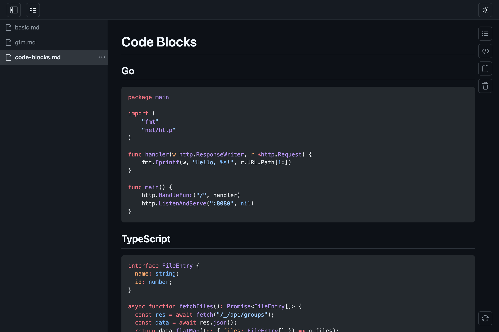
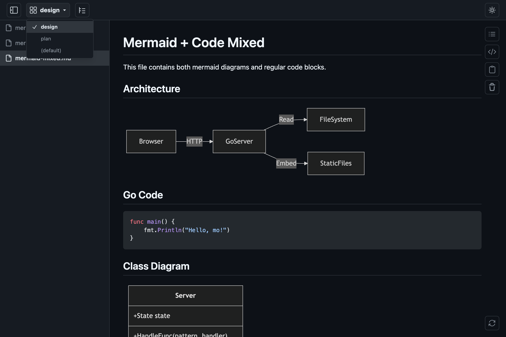

<p align="center">
<br><br><br>

<br><br><br>
</p>

# moted

[](https://github.com/marcinkubica/moted/actions/workflows/ci.yml)

> **moted:** _mo_ but hosted
>
> A fork of [k1LoW/mo](https://github.com/k1LoW/mo) with hosting/server features for shared environments in mind. Original local features of `mo` have been preserved.


> [!NOTE]
> Project has been freshly forked and is in active development. Features may change.

> [!WARNING]
> Application is not ready for public exposure and should be run in trusted environments only.


## What's New in moted

**Configuration & Deployment:**
- YAML configuration file support (`--config`)
- Read-only mode for shared deployments
- Shareable document links with clean URLs
- True filename URLs (optional, falls back to hash IDs for duplicate filenames)
- File timestamps (creation time or relative time)
- Readiness endpoint for health checks
- [docker](https://github.com/marcinkubica/moted/pkgs/container/moted) image

**UI changes:**
- Toolbar is now sticky
- Adjustable font size
- Improved ToC panel with scroll tracking and highlighting
- Share raw file content via direct links
- Control auto-selection of newly added files
- Navigate to files by filename in URL
- Smooth animations and transitions

## Planned Features
- Google/Github SSO
- GCS bucket watching


> Quick start

```sh
docker compose up
```
This will start the server on port 8080 and serve files from the repository directory.

or
```sh
make dev
```

>[!IMPORTANT]
>Original readme has been preserved in full below (for now).

## Features

- GitHub-flavored Markdown (tables, task lists, footnotes, etc.)
- Syntax highlighting ([Shiki](https://shiki.style/))
- [Mermaid](https://mermaid.js.org/) diagram rendering
- LaTeX math rendering ([KaTeX](https://katex.org/))
-  Dark /  light theme
-  File grouping
-  Table of contents panel
-  Flat /  tree sidebar view with drag-and-drop reorder and file search
- YAML frontmatter display (collapsible metadata block)
- MDX file support (renders as Markdown, strips `import`/`export`, escapes JSX tags)
-  Wide /  narrow content width toggle
-  Raw markdown view
-  Copy content (Markdown / Text / HTML)
-  Server restart with session preservation
- Auto session backup and restore
- Drag-and-drop file addition from the OS file manager (content is loaded in-memory; live-reload is not supported for dropped files)
- Live-reload on save (for files opened via CLI)


## Install

**homebrew tap:**

```console
$ brew install marcinkubica/tap/moted
```

**manually:**

Download binary from [releases page](https://github.com/marcinkubica/moted/releases)

## Usage

**Basic usage:**

``` console
$ moted README.md                          # Open a single file
$ moted README.md CHANGELOG.md docs/*.md   # Open multiple files
$ moted spec.md --target design            # Open in a named group
```

**With configuration file:**

``` console
$ moted --config config.yaml               # Start with YAML config
```

See [`docs/config.example.yaml`](docs/config.example.yaml) for all available options including read-only mode, shareable links, and UI behavior controls.

`moted` opens Markdown files in a browser with live-reload. When you save a file, the browser automatically reflects the changes.

### Single server, multiple files

By default, `moted` runs a single server on port `6275`. If a server is already running on the same port, subsequent `moted` invocations add files to the existing session instead of starting a new one.

``` console
$ moted README.md          # Starts a moted server in the background
$ moted CHANGELOG.md       # Adds the file to the running moted server
```

To run a completely separate session, use a different port:

``` console
$ moted draft.md -p 6276
```



### Groups

Files can be organized into named groups using the `--target` (`-t`) flag. Each group gets its own URL path and sidebar.

``` console
$ moted spec.md --target design      # Opens at http://localhost:6275/design
$ moted api.md --target design       # Adds to the "design" group
$ moted notes.md --target notes      # Opens at http://localhost:6275/notes
```



### Glob pattern watching

Use `--watch` (`-w`) to specify glob patterns. Matching files are opened automatically, and watched directories are monitored for new files.

``` console
$ moted --watch '**/*.md'                          # Watch and open all .md files recursively
$ moted --watch 'docs/**/*.md' --target docs       # Watch docs/ tree in "docs" group
$ moted --watch '*.md' --watch 'docs/**/*.md'      # Multiple patterns
```

`--watch` cannot be combined with file arguments. The `**` pattern matches directories recursively.

#### Removing watch patterns

Use `--unwatch` to stop watching a previously registered pattern. Files already added remain in the sidebar.

``` console
$ moted --unwatch '**/*.md'                              # Stop watching a pattern (default group)
$ moted --unwatch 'docs/**/*.md' --target docs            # Stop watching in a specific group
$ moted --unwatch '/Users/you/project/**/*.md'            # Stop watching by absolute path
```

Patterns are resolved to absolute paths before matching, so you can specify either a relative glob or the full path shown by `--status`.

### Sidebar view modes

The sidebar supports flat and tree view modes. Flat view shows file names only, while tree view displays the directory hierarchy.

|  Flat |  Tree |
|------|------|
|  |  |

### Starting and stopping

`moted` runs in the background by default — the command returns immediately, leaving the shell free for other work. This makes it easy to incorporate into scripts, tool chains, or LLM-driven workflows.

``` console
$ moted README.md
moted: serving at http://localhost:6275 (pid 12345)
$ # shell is available immediately
```

Use `--status` to check all running moted servers, and `--shutdown` to stop one:

``` console
$ moted --status              # Show all running moted servers
http://localhost:6275 (pid 12345, v0.12.0)
  default: 5 file(s)
    watching: /Users/you/project/src/**/*.md, /Users/you/project/*.md
  docs: 2 file(s)
    watching: /Users/you/project/docs/**/*.md

$ moted --shutdown            # Shut down the moted server on the default port
$ moted --shutdown -p 6276    # Shut down the moted server on a specific port
$ moted --restart             # Restart the moted server on the default port
```

If you need the moted server to run in the foreground (e.g. for debugging), use `--foreground`:

``` console
$ moted --foreground README.md
```

### Server restart

Click the  restart button (bottom-right corner) or run `moted --restart` to restart the `moted` server process. The current session — all open files and groups — is preserved across the restart. This is useful when you have updated the `moted` binary and want to pick up the new version without re-opening your files.

### Session backup and restore

`moted` automatically saves session state (open files and watch patterns per group) when files are added or removed. When starting a new server, the previous session is automatically restored and merged with any files specified on the command line. Restored session entries appear first, followed by newly specified files.

``` console
$ moted README.md CHANGELOG.md       # Start with two files
$ moted --shutdown                   # Shut down the server
$ moted                              # Restores README.md and CHANGELOG.md
$ moted TODO.md                      # Restores previous session + adds TODO.md
```

Use `--clear` to remove a saved session:

``` console
$ moted --clear                      # Clear saved session for the default port
$ moted --clear -p 6276              # Clear saved session for a specific port
```

### JSON output

Use `--json` to get structured JSON output on stdout, useful for scripting and integration with other tools.

``` console
$ moted --json README.md
{
  "url": "http://localhost:6275",
  "files": [
    {
      "url": "http://localhost:6275/?file=a1b2c3d4",
      "name": "README.md",
      "path": "/Users/you/project/README.md"
    }
  ]
}
```

`--status` also supports `--json`:

``` console
$ moted --status --json
[
  {
    "url": "http://localhost:6275",
    "status": "running",
    "pid": 12345,
    "version": "0.15.0",
    "revision": "abc1234",
    "groups": [
      {
        "name": "default",
        "files": 3,
        "patterns": ["**/*.md"]
      }
    ]
  }
]
```

### Configuration File

For production deployments or complex setups, use a YAML configuration file:

```yaml
# Server settings
bind: 0.0.0.0
port: 8080
foreground: true

# Security & UI behavior
read-only: true              # Shorthand for no-restart + no-delete + no-file-move
shareable: true              # Expose document links in address bar
true-filenames: true         # Use actual filenames in URLs
newfile-no-autoselect: true  # Don't auto-open new files

# Groups and watch patterns
groups:
  - name: docs
    watch:
      - ./docs/**/*.md
```

See [`docs/config.example.yaml`](docs/config.example.yaml) for complete configuration options.

### Command-Line Flags

| Flag | Short | Default | Description |
|------|-------|---------|-------------|
| `--config` | | | Path to YAML configuration file |
| `--target` | `-t` | `default` | Group name |
| `--port` | `-p` | `6275` | Server port |
| `--bind` | `-b` | `localhost` | Bind address (e.g. `0.0.0.0`) |
| `--open` | | | Always open browser |
| `--no-open` | | | Never open browser |
| `--status` | | | Show all running moted servers |
| `--watch` | `-w` | | Glob pattern to watch for matching files (repeatable) |
| `--unwatch` | | | Remove a watched glob pattern (repeatable) |
| `--shutdown` | | | Shut down the running moted server |
| `--restart` | | | Restart the running moted server |
| `--clear` | | | Clear saved session for the specified port |
| `--foreground` | | | Run moted server in foreground |
| `--json` | | | Output structured data as JSON to stdout |
| `--quiet` | `-q` | | Suppress non-error output |
| `--read-only` | | | Disable restart, delete, and file move operations |

> [!WARNING]
> Binding to a non-localhost address exposes moted to the network **without any authentication**. Remote clients can read any file accessible by the user, browse the filesystem via glob patterns, and shut down the server. A confirmation prompt is shown when `--bind` is set to a non-loopback address.

## Build

Requires Go and [pnpm](https://pnpm.io/).

``` console
$ make build
```

## References

- [yusukebe/gh-markdown-preview](https://github.com/yusukebe/gh-markdown-preview): GitHub CLI extension to preview Markdown looks like GitHub.

## License

[MIT License](LICENSE)

### Attribution

This project is a fork of [mo](https://github.com/k1LoW/mo) by [Ken'ichiro Oyama (k1LoW)](https://github.com/k1LoW).

The original author has graciously permitted this fork and the use of the original logo under the MIT license. All copyright notices are preserved in the [LICENSE](LICENSE) file.
